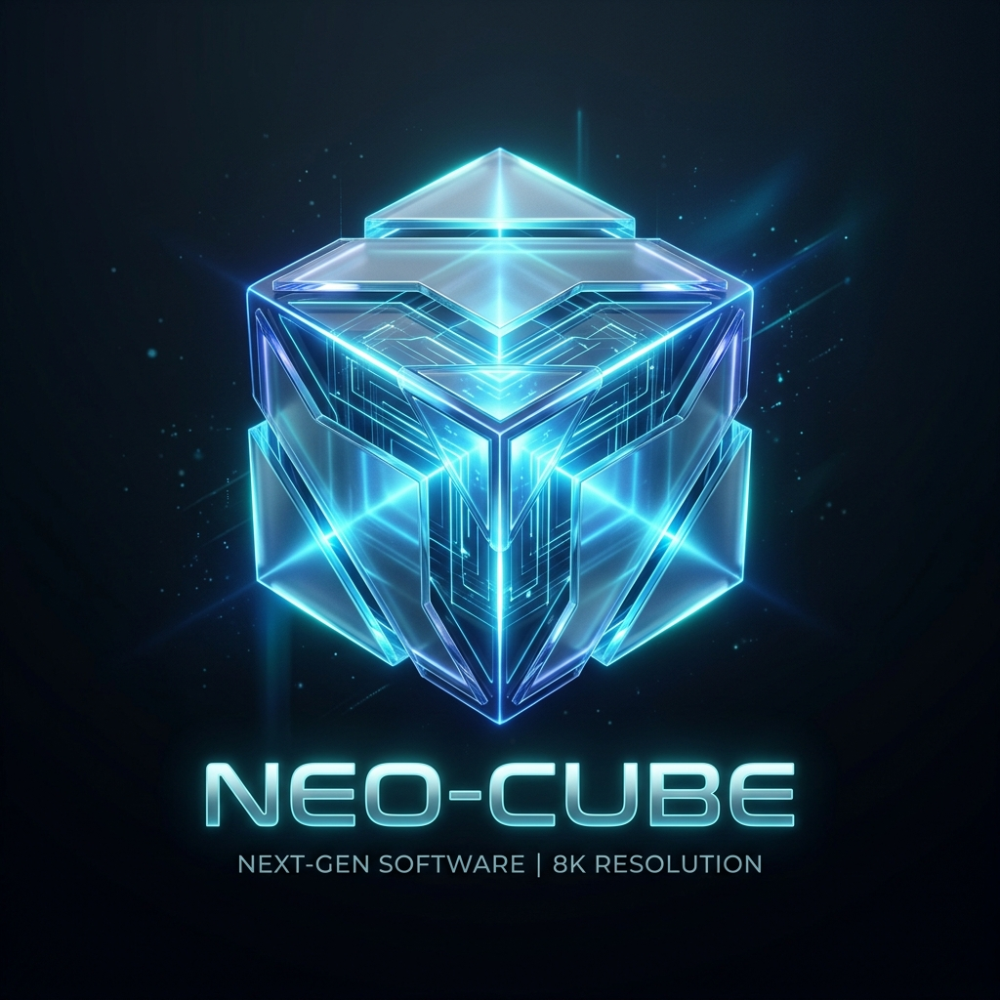

  

# Neo-Cube
**La experiencia de emulación de GameCube de próxima generación.**

Neo-Cube es un emulador de GameCube revolucionario, con precisión de ciclos, construido nativamente sobre el framework **SSPL v9.5**. A través de su Arquitectura Basada en Componentes (CBA), Neo-Cube ofrece un rendimiento absoluto, una interfaz de usuario premium y capacidades de red sin precedentes.

> [!NOTE]
> **Característica Exclusiva:** ¡Neo-Cube soporta nativamente la emulación de **FlippyDrive Deluxe**! Transmite ISOs directamente desde tu PC/NAS a través de un adaptador Ethernet virtual y juega títulos multijugador LAN en todo el mundo mediante P2P.

## 🌟 Características Principales
- **CBA:** Núcleo modular con ejecución síncrona de CPU, GPU y DSP.
- **Neo-Cube Power-Mode:** ¡Desata el máximo rendimiento! Este modo proporciona RAM expandida y un núcleo de CPU Dolphin ultraoptimizado para la máxima fidelidad y velocidad de fotogramas.
- **Neo-Cube Live (NCL):** Multijugador en línea mediante túnel LAN.
- **CubeWave VoIP:** Chat de voz integrado en el sistema operativo para crear grupos.
- **Modo Flippy-OS Deluxe:** Arranca directamente en el firmware original de CubeBoot.
- **Panel "Neo-XMB":** Interfaz de usuario Dark-Mode 4K de nivel consola.

---
*Desarrollado con pasión por SonnerStudio. Reservados todos los derechos.*
