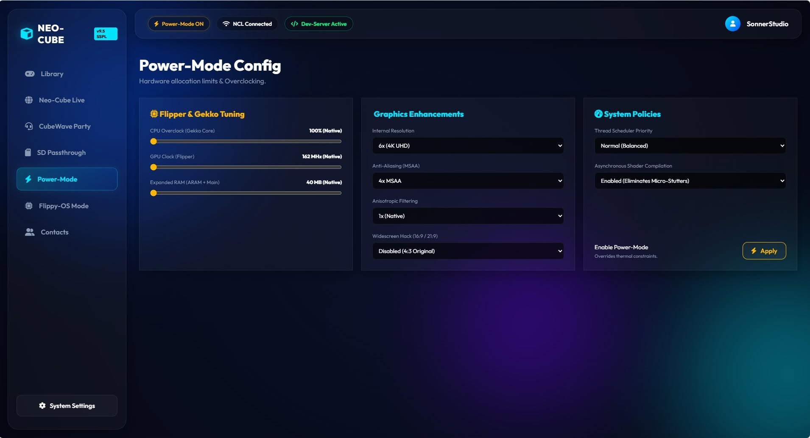
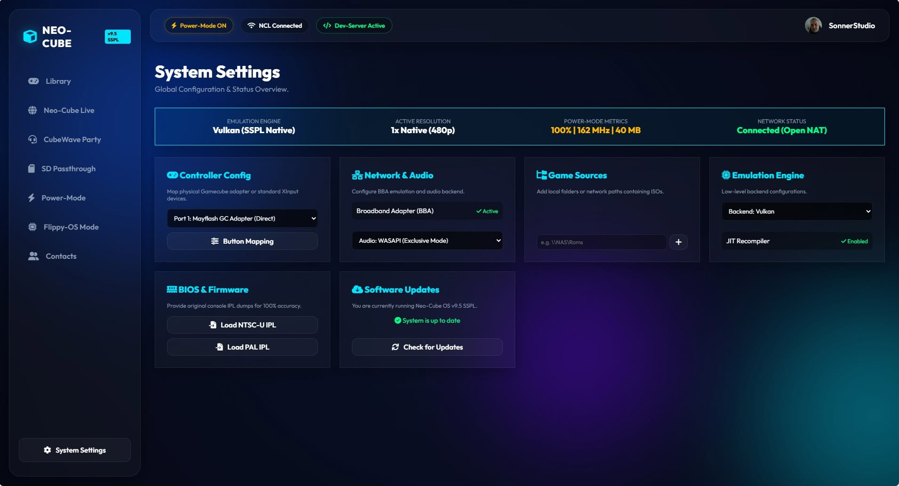

  

# Neo-Cube

  <a href="README.md"> English</a> |
  <a href="README_de.md"> Deutsch</a> |
  <a href="README_es.md"> Español</a> |
  <a href="README_ja.md"> 日本語</a> |
  <a href="README_zh.md"> 中文</a> |
  <a href="README_ru.md"> Русский</a> |
  <a href="README_fr.md"> Français</a>

**L'expérience d'émulation GameCube de nouvelle génération.**

Neo-Cube est un émulateur GameCube révolutionnaire, précis au cycle près, construit nativement sur le framework **SSPL v9.5**. Grâce à son architecture basée sur des composants (CBA), Neo-Cube offre des performances absolues, une interface utilisateur premium et des capacités réseau sans précédent.

> [!NOTE]
> **Fonctionnalité exclusive :** Neo-Cube prend en charge nativement l'émulation **FlippyDrive Deluxe** ! Diffusez des ISO directement depuis votre PC/NAS via un module Ethernet virtuel et jouez à des jeux multijoueurs LAN dans le monde entier via P2P.

## 🌟 Fonctionnalités principales
- **CBA :** Cœur modulaire avec exécution synchrone du CPU, du GPU et du DSP.
- **Neo-Cube Power-Mode :** Libérez les performances maximales ! Ce mode fournit une RAM étendue et un cœur de processeur Dolphin ultra-optimisé pour la fidélité et les fréquences d'images les plus élevées possibles.
  
  

- **Backend Vulkan SSGE :** Intégration native avec le nouveau SonnerStudioGraficEngine (`vulkan_backend.sspl`) pour un rendu impeccable.
- **Module complémentaire Ethernet FlippyDrive :** Émulation LAN/NAS virtuelle (`ethernet_addon.sspl`) pour un chargement transparent des jeux ISO.
- **Interface DVD native :** Nouvel analyseur précis pour les systèmes de fichiers ISO (`dvd_interface.sspl`).
- **Neo-Cube Live (NCL) :** Multijoueur en ligne via un tunnel LAN.
- **CubeWave VoIP :** Chat vocal intégré au système d'exploitation pour créer des groupes.
- **Mode Flippy-OS Deluxe :** Démarrez directement sur le firmware d'origine CubeBoot.
- **Tableau de bord Premium "Neo-XMB" :** Une interface utilisateur époustouflante en mode sombre Glassmorphism 4K fonctionnant à 60 FPS fluides. Construit pour un maximum d'exclusivité.
  
  

## 🚀 À venir : SuperCube-Mode 64
Nous développons actuellement l'évolution ultime : **SuperCube-Mode 64**. Cette couche d'émulation 64 bits de nouvelle génération comprend une refonte complète du matériel virtuel (Neo-Gekko-64 CPU, Neo-Flipper-64 GPU, Neo-Macaron-64 Audio).

Les jeux GameCube classiques sont simultanément transformés via un hachage heuristique et une injection d'actifs à la volée : la rastérisation statique est remplacée par le raytracing dynamique (Illumination Globale & matériaux PBR). Le système passe en interne de 1080p jusqu'aux résolutions 8K ultra-nettes, optimisé par l'IA (DLSS/MetalFX).

Parallèlement, le nouveau SDK SuperCube ouvre des dimensions inédites pour la communauté homebrew : développez des titres de nouvelle génération avec une mémoire et des shaders de calcul illimités, tout en restant fidèle au style nostalgique et bien-aimé de la GameCube ! Préparez-vous à l'Audio Spatial (y compris le réglage audiophile 432 Hz) et à des temps de chargement nuls via l'émulation NVMe PCIe 4.0. *Plus de détails bientôt...*

---
*Développé avec passion par SonnerStudio. Tous droits réservés.*
